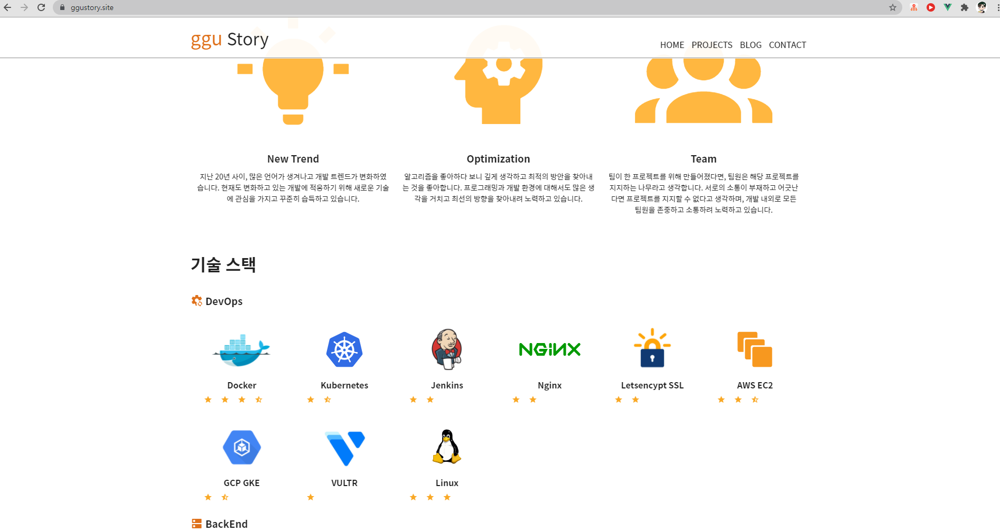
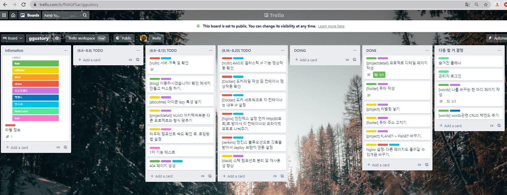

# 프로젝트: 개인 사이트

#### 프로젝트 URL: www.ggustory.site

## 기획

 개발자로 거듭나기 위해 여러 프로젝트를 진행하였고, 그 프로젝트를 표현하는 것은 개인사이트가 적합하다고 생각했습니다. pdf, ppt, photoshop 처럼 많은 툴로 포트폴리오를 만들었지만, 마음에 들지 않았고 개인 사이트를 만들어 배포하기로 하였습니다.

## 진행 사항

#### 첫 진행 사항

* 해당 사이트를 만들며 UI 요소가 조금 트렌디하지 못 하다고 판단하였고, 계획 사이트와 개인 사이트의 경계를 두어야 할 것 같아 갈아 엎었습니다.
  * 예전 커밋 요소를 보면 어느 정도 진행했는지 확인할 수 있습니다.
* 인프라적인 요소로 프리티어 EC2 t2.micro를 사용하려 했으나, 생각하고 있던 도커 및 젠킨스로는 너무 부담이 커서 서버가 자주 다운되었습니다.
  * 상대적으로 싼 클라우드 서비스를 통해 컨테이너 환경과 CI/CD환경을 구축할 예정입니다.

#### 현재화면

* 소개 페이지와 프로젝트 페이지를 구현하였고, 리팩토링 진행중입니다.
* CONTACT 는 카드형식으로 보여지고 사라집니다.

## 기술 스택

* 프론트엔드: Vuejs
* 인프라: AWS EC2, Nginx
* 일정관리: Trello
* 형상관리: Github
* 목업: XD, PhotoShop, IPad Notability

추후, 플래너와 명언, 관리자 페이지를 추가하며 백엔드를 추가할 예정입니다.

현재 플래너 백엔드는 Spring Boot로 90% 완성이 되어 있으나, 사이트의 특성상 가벼운 프레임워크가 적절하다고 판단하여

다른 프레임워크(FastAPI 혹은 node.js, ruby 기반 백엔드 예상)로 다시 백엔드를 만들 가능성이 높습니다.

인프라는 VULTR Cloud Compute로 바꿀 예정이며 새로운 기능의 프론트엔드와 백엔드가 구현되는 즉시 바꿀 예정입니다.

CI/CD 환경을 구축할 예정이며, Jenkins Blueocean을 통해 Docker 컨테이너를 올릴 예정입니다.

## 일정 관리

트렐로를 이용하여 하였습니다.

상태 퍼블릭: https://trello.com/b/fNAGFSar/ggustory

ex)

## 배포

현재  AWS EC2와 Nginx를 통해 배포되었습니다.

## 에러사항

### 첫 진행 에러사항

#### CI/CD

프리티어의 스펙은 CPU 1G 1개, RAM 1G 1개이다.

그렇기 때문에 Jenkins를 사용하면 한 번에 도커 컨테이너가 7개 올라가는 상황이 발생할 수 있다.

해당 시간에 터지기 때문에 수동 컨테이너 배포로 바꾸었다.

#### Docker

컨테이너 3개를 올렸다.

올리는 도중에도 에러가 나서 서버가 터졌다.

이유는 도커 컨테이너를 사용하면서 빌드 했기 때문이었다.

컨테이너 Stop하고 최대한 메모리 먹지 않도록 빌드했더니 컨테이너 3개 올리기에 성공했다.

하지만 5시간만에 바로 터졌다....

해결방안을 찾아야 할 듯하다.

**그렇게 찾은 해결방안은 nginx로 컨테이너 없이 올리기이다. 일단 올렸는데 시간 경과를 지켜보자.**

컨테이너 없이 올리면 올라간다. 메모리, CPU 문제가 맞았다.

**올린 시각: 21.07.19 09:58 UTC+9**

### 현재 에러사항

#### Nginx

배포 시, 루트 url에서는 모든 페이지에 접근가능하지만 직접적으로 다른 프로젝트 url에 들어가지지 않는 현상이 발생했다.

확인 결과, Nginx 설정에서 `try_files $uri $uri/ =404;`로 되어 있어 루트에서 이동하는 것이 아니면 404에러를 뜨게 만들었다.

`try_files $uri $uri/ /index.html;`로 바꾸어 주어 다른 url도 직접적으로 들어가게 만들어 줬다.

하지만 404페이지의 부재가 있기 때문에 404페이지를 커스텀해서 만들어 줘야할 듯 하다.

## 느낀 점 & 고칠 점

### 첫 진행 느낀 점 & 고칠 점

#### 트렐로 이용 적극적으로

트렐로를 이용하는 것을 적극적으로 해야겠다.

혼자라고 하더라도 개발 계획을 중구난방적으로 세워지지 않게 해준다.

#### 몇일은 날 잡고 코드 리팩토링

기능도 중요하지만 코드 품질도 중요하다고 본다.

리팩토링하면서 어느 어떻게하면 빠를지, 다른 적용점이 있는지, UI/UX 개선을 할 필요가 있는지를 계속 업데이트한다.

지금 내가 봐도 아직 개판이다.

api 모으고 쓰는 곳과 Vuex는 좀 마음에 듬...^^

#### 브랜치 따고 셀프 리뷰

코드 리뷰도 좋은 점인데 혼자하니까 이걸 못 한다..

혼자서 브랜치 따고 셀프 리뷰를 하면 좀 더 늘지 않을까?

이번 커밋 후 부터 프론트 / 백 브랜치 따고 셀프 리뷰 강행하자!

### 현재 느낀 점 & 고칠 점

#### 코드는 처음부터 확실하게!

처음부터 셀프 컨벤션과 변수명을 신경써서 지으니까 리팩토링이 편하다.

또한 Page에 해당하는 View는 거의 모든 코드를 Component로 나누어 각 기능 구조를 한 눈에 보기 편하게 만들었다.

이 부분은 정말 중요한 것 같다. 팀 단위로 할 때도 컨벤션을 처음 지키는 것은 어려웠지만,

후반에는 컨벤션을 지킨 코드가 훨씬 가독성, 리팩토링, 코드 리뷰 등에서 많은 성과를 내보였다.
